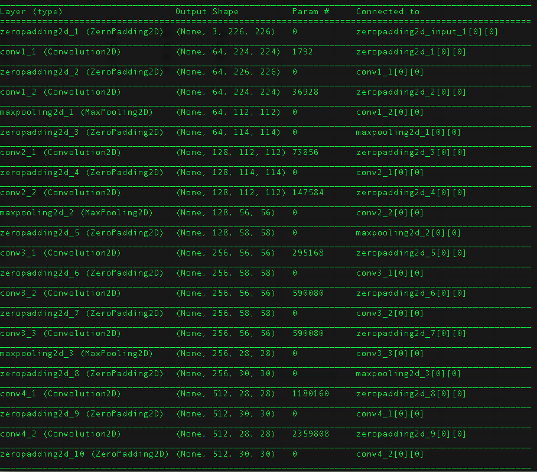
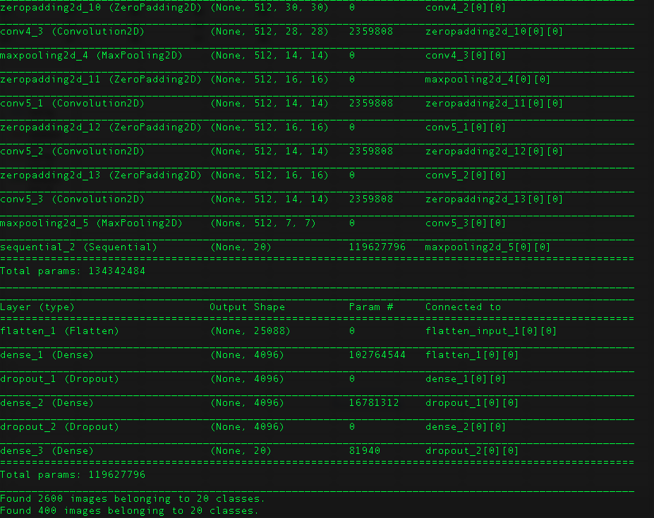
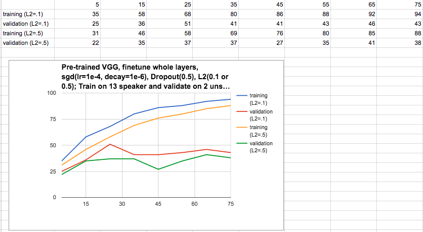
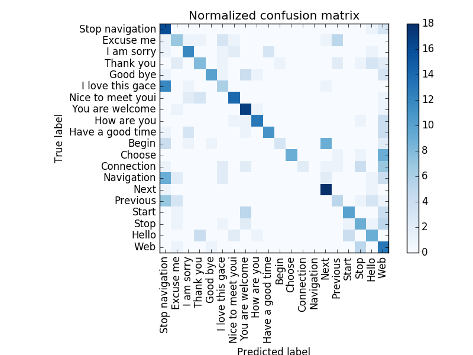

#CNN on visual speech recognition
####0.94Training Accuracy with 0.51 Validation Accuracy of 20 class lip reading
##Category
####Using MIRACL dataset

##Model
VGG16 with two fully connected layers on top. Fully connected layer has Dropout layer(0.5) after them and l2 regularizer with value 0.1 and 0.5 (result show both). Facing overtraining problem.

##Parameter
Optimizer is SGD with learning rate 0.0005 and decay 1e-6, momentum=0.9.
##Result
###Accuracy Chart
#####Show result in 80 epoch.
#####Training accuracy will raise to 93% in the end for l2=0.1
#####Validation gets best result(51%) when epoch is 21 and l2=0.1.

###Confusion Matrix of lip reading

